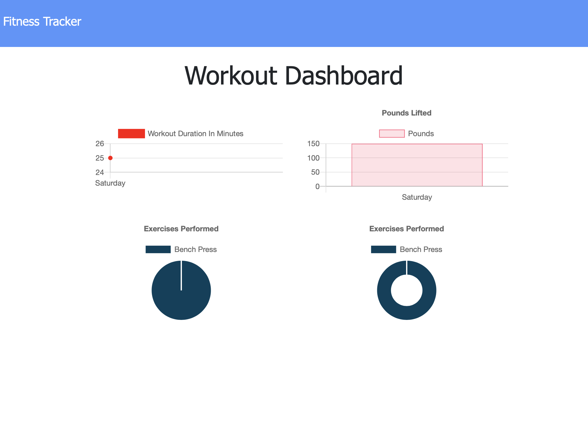
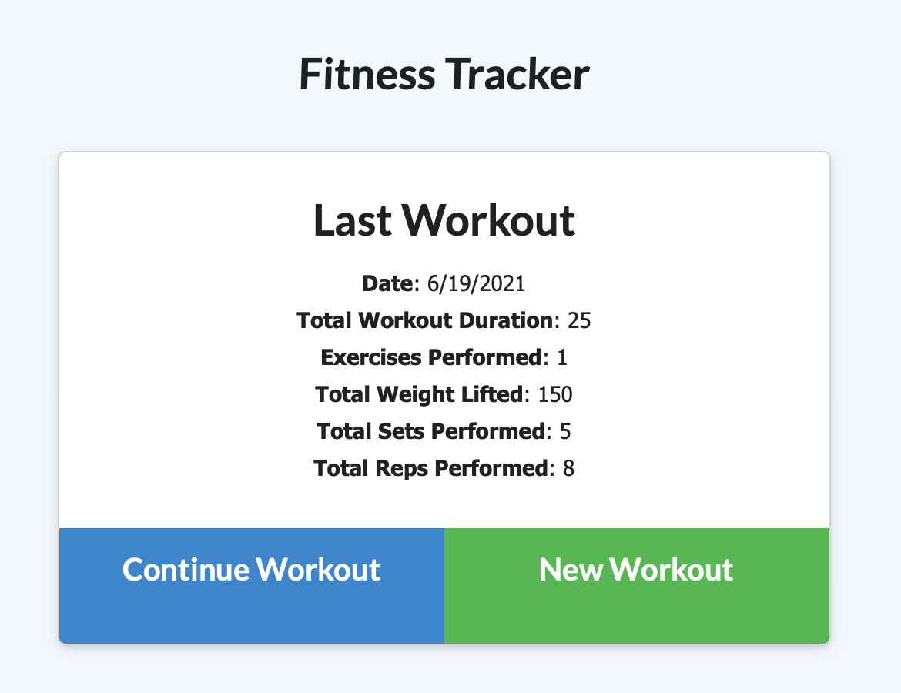

# Workout Tracker

<a href="https://opensource.org/licenses"></a>

## Table of Contents
* [Description](#description)
* [Installation Instructions](#installation-instructions)
* [Usage Information](#usage-information)
* [Contribution Guidelines](#contribution-guidelines)
* [License Information](#license-information)
* [Questions](#questions)

## Description
A MongoDB backend using Mongoose to support a pre-existing front end web application for doing simple fitness tracking.

## Installation Instructions
Run ```npm install``` after downloading the repo. Ensure you have a MongoDB server running and configure the uri in server.js

## Usage Information
Set up and run locally or visit the [live demo!](https://workout-tracker-hw-n8blake.herokuapp.com/)




## Contribution Guidelines
If you wish to contribute, open an issue on GitHub

## License Information

<a href="https://opensource.org/licenses"></a>


		

## Questions
Email [hello@n8blake.com](mailto:hello@n8blake.com)
or create an issue on [Github](https://github.com/n8blake)  
